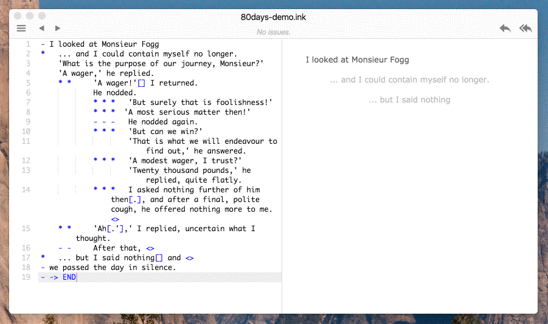

> ## Fork 说明 — Inky 中文版（inky-zh）/ 内置语言切换分支
>
> 本仓库是 [inkle/inky](https://github.com/inkle/inky) 在 `0.15.2` 版本上的
> 社区 **fork**。相比上游它增加了：
>
> - **应用内语言切换菜单**：`View → Language`（中文界面下为 `视图 → 语言`），
>   选中后会持久化到 `view-settings.json`，重启后仍生效；未设置时回退到
>   操作系统语言。
> - **完整的简体中文（`zh-CN`）界面翻译**：覆盖约 100% 可提取字符串，并
>   修正了上游 `zh-CN.json` 中若干漏译与错译。
> - **《Writing with ink》文档简体中文翻译**（`WritingWithInk.zh-CN.md`，
>   约 3400 行，所有 ink 代码示例均保留原文不译）。当界面语言设为 `简体中文`
>   时，应用内置的文档窗口会自动加载中文版。
>
> 原作品 © inkle Ltd，在 `app/package.json` 中声明为 MIT 许可证。完整的
> 出处说明与改动文件清单见 [`NOTICE.md`](./NOTICE.md)。下方为上游 README
> 原文，保持不变。
>
> ### 快速开始 — Windows 用户（无需安装 Node）
>
> 到 **[Releases 页面](https://github.com/luoxin9510/inky-zh/releases/latest)**
> 下载预编译的 Windows x64 包（`Inky-zh-win64.zip`，约 213 MB），解压到
> 任意位置，双击 `Inky.exe` 启动。然后打开 `View → Language` → `简体中文`，
> 在弹出的对话框里选择 **立即重启**。
>
> ### 快速开始 — 从源码运行（Mac / Linux / Windows）
>
> ```bash
> cd app
> npm install
> npm start
> ```
>
> 启动后打开 `View → Language`，选 `简体中文`，按提示重启即可。
> 注意 inklecate 编译器二进制并未包含在本仓库中——从源码运行前请先按
> [`app/main-process/ink/INKLECATE_BINARIES.md`](./app/main-process/ink/INKLECATE_BINARIES.md)
> 的说明取得它们。

---


# Inky

**Inky** 是 [ink](http://www.inklestudios.com/ink) 的编辑器——ink 是 inkle
出品的一种用于游戏交互式叙事的标记语言，曾被用于 [80 Days](http://www.inklestudios.com/80days)
等作品。Inky 是一个集成开发环境（IDE）：在一个应用里既能写脚本，又能
即时游玩、即时排错。



## 功能特性

- **边写边玩**：游玩面板会记住你已经做过的选择；Inky 重新编译后会快进到
  上次停留的位置。
- **语法高亮**
- **即时错误高亮**：Inky 后台持续编译，让你在写代码的同时就发现错误。
- **问题浏览器**：列出 **ink** 中的错误、警告与 TODO，并可一键跳转到对应
  文件的具体行号。
- **跳转到定义**：跳转目标（如 `-> theStreet`）会高亮为超链接，按住 Alt 点击
  即可跳过去。
- **多文件项目支持**：Inky 会自动根据 `INCLUDE` 行推断出整个故事的文件
  结构，无需额外的项目文件。要新建包含文件，直接在想引用的位置写
  `INCLUDE yourfile.ink` 即可。
- **导出为 JSON**：如果你已经在用 [ink-Unity-integration 插件](https://assetstore.unity.com/packages/tools/integration/ink-unity-integration-60055)
  其实不必导出；但导出为 ink 编译后的 JSON 格式仍很有用，特别是配合
  其他 ink 运行时——比如用 [inkjs](https://github.com/y-lohse/inkjs) 在
  网页上跑 **ink** 时。
- **文件监听**：Inky 与现代文本编辑器一样会监听磁盘上的文件改动，外部
  改动会自动同步进编辑器。如果你把 **ink** 文件纳入了版本控制，这点会
  非常有用。

## 项目状态

Inky 已经被多个开发者用于多个实际项目。不过，相比你常用的那些文本编辑
器，它在健壮性与功能完整度上都还差一截——它毕竟是游戏开发者们在业余
时间打磨出的专用软件。

非正式的 [TODO.md](TODO.md) 列出了一些缺失功能与已知问题。如果你想就
其中某条展开讨论，或者提交新的 bug / 功能需求，请到上游
[GitHub issues](http://www.github.com/inkle/inky/issues) 创建 issue。

想跟进 ink 的最新消息，可以[订阅邮件列表](http://www.inklestudios.com/ink#signup)。

## 下载

### Mac、Windows 和 Linux

[下载最新版本](http://www.github.com/inkle/inky/releases/latest)

## 项目设置文件

**提示：以下内容面向有一定技术基础的用户——你需要先了解什么是 JSON 文件。**

如果想为某个具体的 ink 项目自定义 Inky 设置，可以新建一个 JSON 文件，
名字与你的主 ink 文件相同，但扩展名改为 `.settings.json`。例如，主 ink
文件叫 `my_great_story.ink`，那么设置文件就叫 `my_great_story.settings.json`。

下面是一个设置文件的示例：

    {
        "customInkSnippets": [
            {
                "name": "Heaven's Vault",
                "submenu": [
                    {
                        "name": "Camera",
                        "ink": ">>> CAMERA: Wide shot"
                    },
                    {
                        "separator": true
                    },
                    {
                        "name": "Walk",
                        "ink": ">>> WALK: TheInscription"
                    },
                    {
                        "name": "More snippets",
                        "submenu": [
                            {
                                "name": "A snippet in a submenu",
                                "ink": "This snippet of ink came from a submenu."
                            },
                        ]
                    }
                ]
            }
        ],

        "instructionPrefix": ">>>"
    }

* `customInkSnippets` —— 这个数组允许你把项目专属的 ink 代码片段加进
  Ink 菜单。数组里可以放三种条目：
    * **ink 片段**：必须有 `name`（菜单项名称）和 `ink`（点击后插入到
      编辑器的 ink 片段）。
    * **分隔线**：用 `{"separator": true}` 在这个位置插入一条横线。
    * **子菜单**：用 `name` 作为子菜单的标题，配合 `submenu`（同样格式
      的数组）来嵌套更多片段。


* `instructionPrefix` —— 在 ink 里使用某种固定文本格式来给游戏发指令是
  一种常见做法，目的是让游戏执行某些动作，而不是把这些字面文本直接
  显示给玩家。

    例如，在 inkle 内部我们会在 ink 里写类似 `>>> CAMERA: BigSwoop` 这样
  的指令。`>>>` 并非 ink 语法本身的一部分，整行内容会被 ink 当作普通文本
  原样输出。但我们的游戏代码会去解析它，把它转译成一个游戏内的动作。
  为了方便在 Inky 里处理这种约定，你可以通过 *instructionPrefix* 字段
  指定你的指令前缀。

    设置之后，Inky 会在编辑器视图和游玩视图里高亮这一类行，让你一眼看
  出它们不是真正要显示给玩家的剧情文本。


## 实现细节

Inky 使用以下技术构建：

* [Electron](http://electron.atom.io/)——GitHub 出品的跨平台桌面应用框架，
  允许用 HTML / CSS / JavaScript 开发桌面端。
* [Ace](https://ace.c9.io/#nav=about)——一款功能完整的网页代码编辑器。
* [Photon](http://photonkit.com/)——用于部分 UI 组件。其实这个依赖未必必
  需，毕竟项目里只用了它的一小部分 CSS。

Inky 内置了一份 **inklecate**——ink 的命令行编译器。

## 帮助开发 Inky！

去 [issues 页面](https://github.com/inkle/inky/issues) 找一个带 "help wanted"
标签的 issue。我们通常会在加标签时给出一些上手该功能的基础说明。

构建项目的步骤：

* 如果还没装 [node.js](https://nodejs.org/en/)，先装好它
* 克隆仓库
* Mac 上双击 `INSTALL_AND_RUN.command` 脚本；Windows 上打开 Powershell，
  cd 到 app 目录，依次运行 `npm install`、`npm start`。
* 之后如果 npm 包没变，可以直接用 `RUN.command`（Mac）或者在命令行里
  跑 `npm start`（Windows）。

### Linux

在全新的 **Ubuntu 16.04 LTS** 虚拟机上测试过（_其他发行版应当流程类似_）

* 安装构建工具

`sudo apt-get install -y dkms build-essential linux-headers-generic linux-headers-$(uname -r)`

* 安装前置依赖

`sudo apt install git`

`sudo apt install curl`

* 安装 node 与 npm

`curl -sL https://deb.nodesource.com/setup_8.x | sudo -E bash -`

`sudo apt-get install -y nodejs`

* 按 http://www.mono-project.com/download/stable/#download-lin 的说明安装 mono

`sudo apt-key adv --keyserver hkp://keyserver.ubuntu.com:80 --recv-keys 3FA7E0328081BFF6A14DA29AA6A19B38D3D831EF`

`echo "deb http://download.mono-project.com/repo/ubuntu stable-xenial main" | sudo tee /etc/apt/sources.list.d/mono-official-stable.list`

`sudo apt-get update`

`sudo apt-get install mono-complete`

* 克隆 inky 仓库

`git clone https://github.com/inkle/inky.git`

* 用 mono 测试 inklecate_win（_正常情况下应该输出用法说明_）

`mono app/main-process/ink/inklecate_win.exe`

* 安装并启动 inky

`./INSTALL_AND_RUN.command`

* 之后如果 npm 包没变，直接这样启动即可（否则重跑上一步）：

`./RUN.command`

### 翻译

翻译文件位于 `app/main-process/i18n/`。  
如果某个语言文件缺失（或缺了某些 key），可以用下面的命令生成：
`cd app && npm run generate-locale -- <locale> ./main-process/i18n/`。

## 为 Inky 贡献翻译

我们欢迎社区为 Inky 补充新语言或完善现有翻译。

### 当前 locale 清单

| Locale  | 语言         | 状态                                    |
|---------|--------------|-----------------------------------------|
| zh-CN   | 简体中文     | ✅ 完整（本 fork 主打语言）              |
| fi-FI   | Suomi        | ✅ 上游维护                              |
| ru-RU   | Русский      | ✅ 上游维护                              |
| en-US   | English      | 源字符串（无需 JSON）                    |
| zh-TW   | 繁體中文     | ❌ 尚无，欢迎贡献                        |
| 其他    | —            | 欢迎 PR                                  |

CI 会自动计算每个 locale 相对参考 locale 的 key 覆盖率（见
`.github/workflows/lint-i18n.yml`）。低于 50% 会让 CI 失败，低于 80%
会在 PR summary 中标黄提示。

### 加新 locale 的步骤

1. 在 `app/main-process/i18n/` 复制现有 JSON（推荐 `zh-CN.json` 作模板）
   为 `<your-locale>.json`，例如 `zh-TW.json`、`fr-FR.json`。
   也可以用 `cd app && npm run generate-locale -- <locale> ./main-process/i18n/`
   生成空模板。
2. 把 JSON 里每个 value 翻译成目标语言。**保留 key 不动**，保留
   `%s`、`{0}`、HTML 标签等占位符。
3. 编辑 `app/main-process/appmenus.js` 的 `LANGUAGE_LABELS`，加上你的
   locale code → 显示名（建议带国旗 emoji，例如 `'🇹🇼 繁體中文'`）。
4. 本地 `npm start` 跑一下，从 Language 菜单切到新 locale 验证显示。
5. 提交 PR：在 [luoxin9510/inky-zh](https://github.com/luoxin9510/inky-zh)
   开 Pull Request，描述里说明 locale 完成度（哪些 key 还没翻好都没关系）。

### 协调与讨论

目前没有专门的翻译平台。如果想协调多人合作、避免重复劳动，请在
[GitHub Issues](https://github.com/luoxin9510/inky-zh/issues) 开一个
issue，标题写 `[i18n] <locale>` 即可。

> 未来若贡献者数量增长，可能会引入 Crowdin 或 POEditor 等翻译协作平台。
> 目前仍以 GitHub PR 为唯一权威流程。

## 许可证

**Inky** 和 **ink** 以 MIT 许可证发布。虽然原作者并不强制要求署名，但
如果你打算把 **ink** 用到项目里，他们很愿意听到这个消息！可以通过
[Twitter](http://www.twitter.com/inkleStudios) 或 [邮件](mailto:info@inklestudios.com)
告知 inkle。

以下为 MIT 许可证原文（法律文本传统上保留英文）：

### The MIT License (MIT)
Copyright (c) 2016 inkle Ltd.

Permission is hereby granted, free of charge, to any person obtaining a copy of this software and associated documentation files (the "Software"), to deal in the Software without restriction, including without limitation the rights to use, copy, modify, merge, publish, distribute, sublicense, and/or sell copies of the Software, and to permit persons to whom the Software is furnished to do so, subject to the following conditions:

The above copyright notice and this permission notice shall be included in all copies or substantial portions of the Software.

THE SOFTWARE IS PROVIDED "AS IS", WITHOUT WARRANTY OF ANY KIND, EXPRESS OR IMPLIED, INCLUDING BUT NOT LIMITED TO THE WARRANTIES OF MERCHANTABILITY, FITNESS FOR A PARTICULAR PURPOSE AND NONINFRINGEMENT. IN NO EVENT SHALL THE AUTHORS OR COPYRIGHT HOLDERS BE LIABLE FOR ANY CLAIM, DAMAGES OR OTHER LIABILITY, WHETHER IN AN ACTION OF CONTRACT, TORT OR OTHERWISE, ARISING FROM, OUT OF OR IN CONNECTION WITH THE SOFTWARE OR THE USE OR OTHER DEALINGS IN THE SOFTWARE.

-

*Inky 这个名字取自一只生活在英国剑桥的黑猫。*
